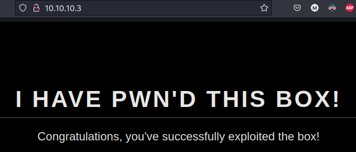

# Box: Lame
Roughly my 4th box on HTB, on my own, taking one hint when stuck on the first vector.
Went beyond-root to hijack the port 80 for a personal statement.

## `nmap` / recon
```
sudo nmap -sC -sV -p 21,22,139,445 10.10.10.3     

PORT    STATE SERVICE     VERSION
21/tcp  open  ftp         vsftpd 2.3.4
..
22/tcp  open  ssh         OpenSSH 4.7p1 Debian 8ubuntu1 (protocol 2.0)
..
139/tcp open  netbios-ssn Samba smbd 3.X - 4.X (workgroup: WORKGROUP)
445/tcp open  U  Samba smbd 3.0.20-Debian (workgroup: WORKGROUP)
Service Info: OSs: Unix, Linux; CPE: cpe:/o:linux:linux_kernel
```

## vector 1: `vsftpd`
Not much to be gained from `anonymous` ftp login, so searching for  vsftpd CVEs:
```
searchsploit -w vsftpd 2.3.4
----------------------------------------------------------------------- --------------------------------------------
 Exploit Title                                                         |  URL
----------------------------------------------------------------------- --------------------------------------------
vsftpd 2.3.4 - Backdoor Command Execution                              | https://www.exploit-db.com/exploits/49757
vsftpd 2.3.4 - Backdoor Command Execution (Metasploit)                 | https://www.exploit-db.com/exploits/17491

```
Seems like lower-hanging fruit than Samba for now.

## initial foothold

After finding the CVE in `msfconsole`:
```
msf6 exploit(unix/ftp/vsftpd_234_backdoor) > set rhosts 10.10.10.3
```
After trying a few different settings, I gave up on this vector. But I learned:
- no `nc -lvnp <port>` is necessary to `run` from `msfconsole`
- `lsof -i :<port>`

I took a hint here to "abort" going down this path, which is time-saving.

## vector 2: `samba`
```
searchsploit -w samba 3.0.2
----------------------------------------------------------------------- --------------------------------------------
 Exploit Title                                                         |  URL
----------------------------------------------------------------------- --------------------------------------------
Samba 3.0.20 < 3.0.25rc3 - 'Username' map script' Command Execution (M | https://www.exploit-db.com/exploits/16320
Samba 3.0.21 < 3.0.24 - LSA trans names Heap Overflow (Metasploit)     | https://www.exploit-db.com/exploits/9950
Samba 3.0.24 (Linux) - 'lsa_io_trans_names' Heap Overflow (Metasploit) | https://www.exploit-db.com/exploits/16859
Samba 3.0.24 (Solaris) - 'lsa_io_trans_names' Heap Overflow (Metasploi | https://www.exploit-db.com/exploits/16329
Samba 3.0.27a - 'send_mailslot()' Remote Buffer Overflow               | https://www.exploit-db.com/exploits/4732
Samba 3.0.29 (Client) - 'receive_smb_raw()' Buffer Overflow (PoC)      | https://www.exploit-db.com/exploits/5712
Samba < 3.0.20 - Remote Heap Overflow                                  | https://www.exploit-db.com/exploits/7701
Samba < 3.6.2 (x86) - Denial of Service (PoC)                          | https://www.exploit-db.com/exploits/36741

```

Going down the list, starting with first one `multi/samba/usermap_script`

Upgrading the `root` shell, and get both flags
```
python -c 'import pty;pty.spawn("/bin/bash")'
export TERM=xterm

cat /home/makis/user.txt
cat /root/root.txt
```

## Beyond Root
A bit more exploration, first looking at the reverse shell `lsof -i :4444`
```
ruby    398950 vcap   10u  IPv4 842994      0t0  TCP 10.10.14.6:4444->10.10.10.3:34594 (ESTABLISHED)
```
The high number port `34594` is interesting, and worth looking at the exploit script to find out the mechanics.

Then loading the `linpeas.sh` and `pspy` onto the box.
```
id
uid=0(root) gid=0(root)

uname -a
Linux lame 2.6.24-16-server #1 SMP Thu Apr 10 13:58:00 UTC 2008 i686 GNU/Linux
```

From `linpeas.sh` no credentials to exfil.

From `pspy32` (interesting) I can see `apache2` is on there and we can open up port 80.

with `systemctl` and `service` not available for this machine, after some digging, to serve the page in `/var/www/html`:
```
sudo /etc/init.d/apache2 start

netstat -tuln | grep 80
tcp        0      0 0.0.0.0:8009            0.0.0.0:*               LISTEN     
tcp        0      0 0.0.0.0:80              0.0.0.0:*               LISTEN     
tcp        0      0 0.0.0.0:8180            0.0.0.0:*               LISTEN     
udp        0      0 127.0.0.1:58038         0.0.0.0:*                         

ufw status
Firewall loaded
To                         Action  From
--                         ------  ----
22:tcp                     ALLOW   Anywhere
22:udp                     ALLOW   Anywhere
21:tcp                     ALLOW   Anywhere
3632:tcp                   ALLOW   Anywhere
3632:udp                   ALLOW   Anywhere
139:tcp                    ALLOW   Anywhere
139:udp                    ALLOW   Anywhere
445:tcp                    ALLOW   Anywhere
445:udp                    ALLOW   Anywhere

sudo ufw allow 80/tcp
sudo ufw reload
```

This works like a charm, and actually I asked GPT to write a fancy page and put it on `/var/www/`, the result:


## AAR
I'll revisit this box in the future to DIY the exploit script from scratch.